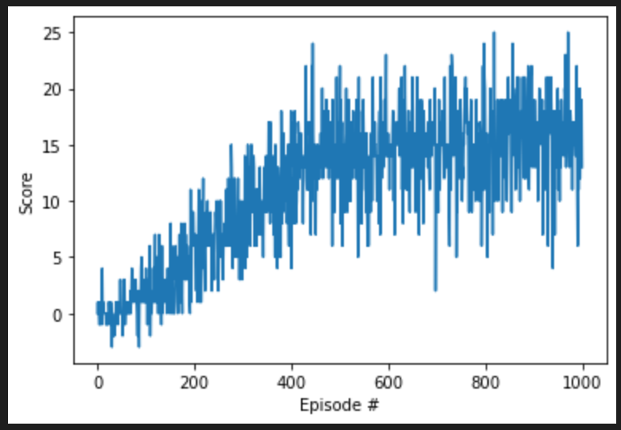
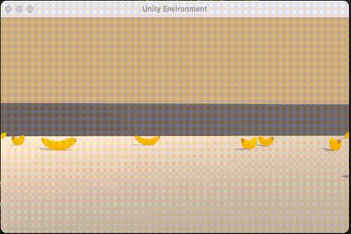

# Udacity RL course: Project 1 - Report

## Learning algorithm
The training algorithm is roughly structure as follows:
- The environment is initialized and the initial state is obtained
- The state is passed to the agent, which returns an action
- This action is passed to the environment, which will respond with a new state, a reward and a flag indicating if the episode is finished or not
- This tuple (new state, reward, done) is passed to the agent so it can update it's learning process.
- The new state is passed to the agent, restarting the loop.

The state value function is modeled as a Neural Network with 2 hidden dense layers (each with 64 units). The parameters used in the DQN algorithm are the default given on the course:
Maximum steps per episode: 1000 (irrelevant since the environment finishes after 300 steps)
Starting epsilion: 1.0
Ending epsilion: 0.01
Epsilion decay rate: 0.999

## Results
The agent is capable to achieve an average score of >13 after approximatly 500 episodes.

```
Episode 100	Average Score: 0.58
Episode 200	Average Score: 3.13
Episode 300	Average Score: 6.87
Episode 400	Average Score: 10.39
Episode 500	Average Score: 14.01
Episode 600	Average Score: 13.79
Episode 700	Average Score: 14.80
Episode 800	Average Score: 14.90
Episode 900	Average Score: 15.55
Episode 1000 Average Score: 15.76
```



Visual inspection of the agent behavior in the environment confirms that it acts as expected


## Future work
- Optimizing hyperparameters and the NN architecture.
- Double Deep Q Networks
- Prioritized Experience Replay
- Dueling Deep Q Networks
- Training the agent on the actual pixel values instead of the pre-processed states.
